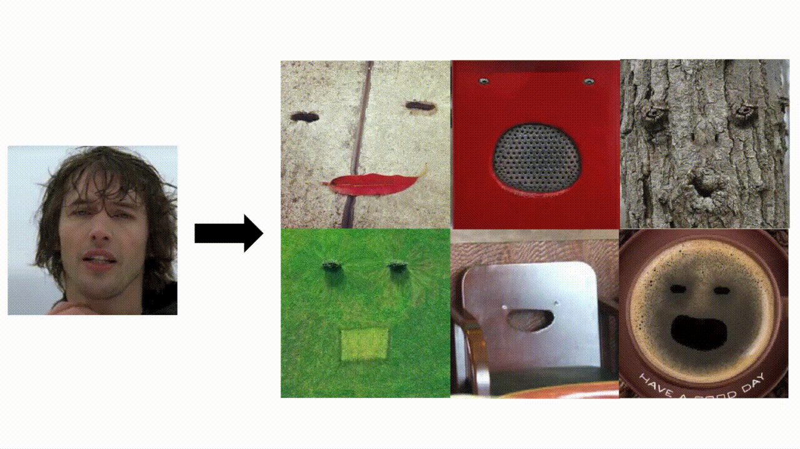
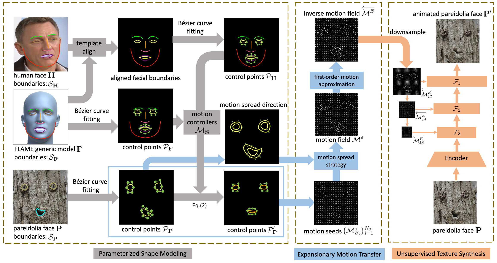

# Everything's Talkin': Pareidolia Face Reenactment (CVPR2021)

Linsen Song, [Wayne Wu](https://wywu.github.io), [Chaoyou Fu](https://bradyfu.github.io), Chen Qian, [Chen Change Loy](https://www.mmlab-ntu.com/person/ccloy/), and [Ran He](https://rhe-web.github.io)

[[Paper]](http://arxiv.org/abs/2104.03061), [[Video]](https://www.youtube.com/watch?v=lVYZ3IAVM_U)



We present a new application direction named Pareidolia Face Reenactment, which is defined as animating a static illusory face to move in tandem with a human face in the video.
For the large differences between pareidolia face reenactment and traditional human face reenactment, two main challenges are introduced, i.e., shape variance and texture variance.
In this work, we propose a novel Parametric Unsupervised Reenactment Algorithm to tackle these two challenges. Specifically, we propose to decompose the reenactment into three catenate processes: shape modeling, motion transfer and texture synthesis.
With the decomposition, we introduce three crucial components, i.e., Parametric Shape Modeling, Expansionary Motion Transfer and Unsupervised Texture Synthesizer, to overcome the problems brought by the remarkably variances on pareidolia faces.
Extensive experiments show the superior performance of our method both qualitatively and quantitatively.



## Requirements

- Python: 3.7
- Other package requirements:
  ```
  pip install requirements
  ```

## DEMO

1. Human video and pareidolia face are `256*256`;
2. Extract 3D facial landmarks of human video as in `test/yrb_256.txt`;
3. Sample points on the labels of the pareidolia face's mouth and eyes as in `points.txt`;
4. run the demo script:
   ```
   python test.py --test_video=./test/result.mp4 --test_fps=29.97 --test_ldmk=./test/yrb_256.txt --test_image=test/speaker.png
   ```
5. the result video is `test/result.mp4`.

## To Do

- [ ] First-order Motion Approximation
- [ ] Unsupervised Texture Animator

## Citation

```
@inproceedings{song2021pareidolia,
  title     = {Pareidolia Face Reenactment},
  author    = {Song, Linsen and Wu, Wayne and Fu, Chaoyou and Qian, Chen and Loy, Chen Change and He, Ran},
  booktitle = {IEEE Conference on Computer Vision and Pattern Recognition (CVPR)},
  year      = {2021},
}
```


